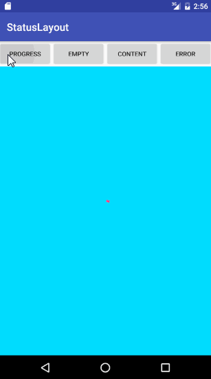

## StatusLayout

A custom layout to display four layout depends on situation. These four layout are:

* Progress Layout
* Empty Layout
* Content Layout
* Error Layout

## Screenshot



## Usage

Add `com.owen.statuslayout.StatusLayout` to your layout. like this

```
<com.owen.statuslayout.StatusLayout
	android:id="@+id/statusLayout"
	android:layout_width="match_parent"
	android:layout_height="match_parent">

	<TextView
		android:layout_width="wrap_content"
		android:layout_height="wrap_content"
		android:layout_gravity="center"
		android:text="Contents"/>
</com.owen.statuslayout.StatusLayout>
```

Then in your code, you can show progress layout by:

```
mStatusLayout.setMode(StatusLayout.MODE.PROGRESS);
```

show empty layout by:

```
mStatusLayout.setMode(StatusLayout.MODE.EMPTY);
```

show content layout by:

```
mStatusLayout.setMode(StatusLayout.MODE.CONTENT);
```

show error layout by:

```
mStatusLayout.setMode(StatusLayout.MODE.ERROR);
```

## Customization

You also replace these four layout to your custom layout. For example, if you want to use your progress layout, you can invoke method

```
mStatusLayout.setProgressLayout(R.layout.your_custom_press_layout);
```

or

```
View yourCustomProgressLayout = LayoutInflater.from(this).inflate(R.layout.status_layout_empty, null);
mStatusLayout.setProgressLayout(yourCustomProgressLayout);
```

Of course, you can also define your layout in layout.xml file. StatusLayout supply these attributes to customize the views.

```
<declare-styleable name="StatusLayout">
	<attr name="progressLayout" format="reference" />
	<attr name="emptyLayout" format="reference" />
	<attr name="errorLayout" format="reference" />
</declare-styleable>
```

## Demo

An [demo](https://github.com/owenmike/StatusLayout/blob/master/demo/src/main/java/com/owen/demo/MainActivity.java)  is available.

## License

```
            DO WHAT THE FUCK YOU WANT TO PUBLIC LICENSE
                    Version 2, December 2004

 Copyright (C) 2004 Sam Hocevar <sam@hocevar.net>

 Everyone is permitted to copy and distribute verbatim or modified
 copies of this license document, and changing it is allowed as long
 as the name is changed.

            DO WHAT THE FUCK YOU WANT TO PUBLIC LICENSE
   TERMS AND CONDITIONS FOR COPYING, DISTRIBUTION AND MODIFICATION

  0. You just DO WHAT THE FUCK YOU WANT TO.
```
